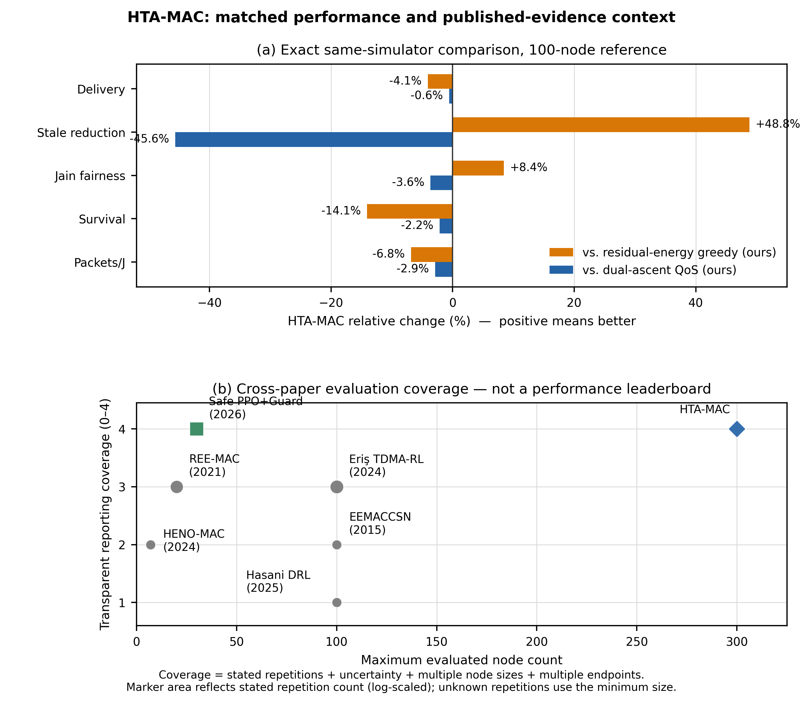

# HTA-MAC performance against primary published work

**Prepared:** 31 August 2026  
**Purpose:** Determine how strong the current HTA-MAC model is relative to
nearby published EH-WSN scheduling and MAC work without constructing an invalid
cross-simulator leaderboard.

## 1. Bottom line

HTA-MAC is **architecturally interesting and unusually well audited, but it is
not presently a state-of-the-art performance winner**.

Its strongest defensible advantages are:

1. exact feasibility under a hard per-cluster slot budget;
2. permutation-equivariant shared node scoring rather than index-specific heads;
3. constant learned parameter storage (116,033 parameters) while executing from
   50 through 300 nodes;
4. joint reporting of delivery, stale loss, fairness, lifetime, and packets/J;
5. paired independent-seed inference with bootstrap confidence intervals and
   Holm-adjusted signed-rank tests;
6. controlled MAC-only attribution with cluster-head scheduling and routing held
   outside the learned controller.

Its central weakness is empirical: in the corrected common-simulator audit,
queue-cap-feasible residual-energy allocation and online dual-ascent control
both have better aggregate delivery, survival, and energy efficiency. HTA-MAC's
remaining advantage is lower stale loss and, from 100 nodes onward, higher
service fairness than residual-energy allocation.

The paper should therefore claim a **scalable, auditable constrained scheduling
architecture with a measured fairness--staleness trade-off**, not general
superiority over existing EH-MAC protocols.

## 2. Current HTA-MAC operating point

The upper panel is the only direct performance comparison: every policy uses
the same simulator, cohort, horizon, and endpoints. The lower panel compares
evaluation coverage rather than performance because published endpoints and
environments are incompatible.

The corrected 100-node reference means are:

| Policy | Delivery | Stale ratio | Jain fairness | Restricted survival | Packets/J |
|---|---:|---:|---:|---:|---:|
| HTA-MAC | 0.42770 | 0.02476 | 0.94511 | 128.28 | 225.77 |
| Residual-energy greedy, author-constructed | **0.44591** | 0.04838 | 0.87166 | **149.32** | **242.36** |
| Online dual-ascent QoS, author-constructed | 0.43020 | **0.01700** | **0.98081** | 131.10 | 232.45 |

Against residual-energy greedy, HTA-MAC improves stale loss and fairness but
loses 0.01821 delivery, 21.04 survival rounds, and about 6.85% packets/J. Against
online dual-ascent, HTA-MAC is also numerically lower in delivery, survival, and
packets/J. These comparators are locally constructed reference policies, not
exact reproductions of named papers.

At 300 nodes, the gaps to the residual-energy heuristic become smaller, while
HTA-MAC has 0.0252 lower stale loss and 0.1345 higher fairness. Execution through
300 nodes is meaningful evidence of architectural scalability, but it does not
by itself establish performance superiority.

## 3. Primary-paper comparison

| Primary paper | Published system and result | Evidence quality | What it says about HTA-MAC |
|---|---|---|---|
| Hasani et al., *Scientific Reports* (2025) | DQN-style continuous-energy transmission control in clustered solar EH-WSNs; 20--100 nodes in a 200 m by 200 m field; reported 11.79% throughput improvement over clustering/RL comparators. | Repetitions, seeds, CIs, and p-values were not specified on the primary article page. Clustering follows an earlier method. | This is one of the closest terrestrial DRL papers. Its headline throughput gain is more positive than HTA-MAC's corrected delivery result, but its attribution and statistical reporting are weaker. No direct numeric ranking is valid without a shared simulator. |
| Nazamdin and Reid, *Sensors* (2026) | Safety-constrained PPO transmission scheduling for solar seismic WSNs at 10, 15, and 30 nodes. At 30 nodes, PPO+Guard reports 99.46% success and 66.47% survival, with +15.4% survival over PPO. | 50 independent episodes per configuration, plus four disjoint 50-episode blocks for the headline case; 95% t intervals. Custom single-hop simulator, no fading or packet loss, and no 100+ node test. | This is the strongest modern constrained-RL methodological comparator. HTA-MAC has the stronger scale test and a richer clustered action contract; this paper has the more convincing positive service/survival outcome. HTA-MAC needs a recognized safe-RL baseline under the same simulator to close this gap. |
| Eriş et al., *Sensors* (2024) | RL-aware clustered underwater TDMA with 100 acoustic nodes and piezoelectric harvesting. TDMA-RL captures 96% of available energy versus 56% for TDMA-EH; HND/LND improve, but mean FND remains about 25 rounds and does not improve over TDMA-EH. | 100 random topology simulations; reports means, medians, and standard deviations. | This paper supports HTA-MAC's honest interpretation that learned allocation can help later-life or utilization endpoints without improving FND. Acoustic channels and piezoelectric harvesting make its percentages non-transferable. |
| Gong et al., *IET Communications* (2021) | FFSS/AFSS optimize fixed/adaptive TDMA slot ordering using future data and harvested energy; Hungarian solution; compared with FOS, TASA, and SHR-TDMA. | Reported means from 10^6 simulation runs, mainly through channel/slot-utilization graphs; uncertainty intervals are not prominent. | This is the strongest analytical scheduling comparator. The present round-level HTA-MAC environment chooses slot counts, not within-frame order, so the existing FFSS-adapted policy is not an exact reproduction. A packet/subslot simulator extension would be needed for a truly direct test. |
| Movva et al., *International Journal of Communication Systems* (2022) | S2A2MAC combines HMM-driven semi-synchronized active periods with unequal clustering, routing, and emergency routing in NS-3.26. | The public article metadata does not expose a reusable HMM checkpoint or complete parameters needed for bit-exact transplantation. | Conceptually close because it combines HMM state and EH scheduling, but its reported gains cannot be attributed to MAC alone. The current S2A2MAC-adapted comparator must remain labelled as an adaptation. |
| Sarang et al., HENO-MAC, *IEEE WCNC* (2024) | Hybrid solar/wind, priority-aware duty cycling in GreenCastalia for 1--7 senders over two days of NREL traces. Reports up to 28.5% lower average delay and final remaining energy of 59.8%, versus about 48.7--50% for the compared protocols. | Trace-driven experiment, but no reported seed-level CIs or p-values. | HENO-MAC has stronger trace realism for hybrid ambient harvesting and a positive delay result. HTA-MAC covers clustered per-node allocation, larger networks, uncertainty analysis, and more endpoints. The energy sources and time endpoints differ, so no direct percentage ranking is valid. |
| Lee et al., REE-MAC, *Sensors* (2021) | Residual-energy estimation in a wireless-powered network with 2--20 receivers within 4 m of an RF power transmitter. Reports large fairness and charging/freezing-time gains over FF-WPT and HE-MAC. | MATLAB, 50 iterations; averages/distributions but no explicit CIs. | Useful evidence that residual-energy-aware scheduling is a serious baseline. It is wireless power transfer, not ambient EH, and its fairness definitions are not identical to HTA-MAC's service fairness. |
| Sefuba et al., EEMACCSN, *Sensors* (2015) | Cross-layer clustered scheduling and cooperative inter-cluster relaying for 100 nodes; graphical improvements in energy, lifetime, delay, and throughput over BMA-RR. | Analytical model plus custom event-driven simulation; results are largely graphical and combine changes at several layers. | HTA-MAC has cleaner causal attribution because routing and CH selection are not changed. EEMACCSN has a broader end-to-end protocol, so its apparent gains cannot be treated as a MAC-only comparison. |
| Iannello et al., *IEEE Transactions on Communications* (2012) | Foundational analysis of EH-aware MAC and the trade between delivery/time efficiency and stochastic energy availability. | Analytical theory rather than a directly reusable learned-policy benchmark. | Supports the problem formulation and the need for multi-endpoint evaluation; it does not provide a direct numerical leaderboard for HTA-MAC. |

## 4. Where HTA-MAC is genuinely stronger

### Evaluation rigor

HTA-MAC's paired design, independent run-level inference, bootstrap intervals,
multiple-testing correction, feasibility audit, and explicit negative results
are stronger than papers that report only one curve or one percentage without
uncertainty. This is a publication strength, but rigorous analysis cannot turn
an adverse effect into a performance win.

### Architectural scaling

The shared permutation-equivariant scorer executes through 300 nodes without
growing learned parameter storage. The 2026 safe-RL comparator stops at 30 nodes
and explicitly identifies 100+ node scaling as future work. Hasani et al. test
through 100 nodes but do not establish permutation equivariance or fixed model
storage across node counts. HTA-MAC can therefore make a narrow and defensible
scalability claim.

### Causal scope

HTA-MAC isolates intra-cluster slot-count allocation. S2A2MAC and EEMACCSN
combine MAC with clustering or routing, which makes their larger headline gains
harder to attribute. This controlled scope is scientifically valuable even
though it reduces the opportunity to obtain dramatic end-to-end gains.

### Multi-objective visibility

Many nearby papers optimize throughput, utilization, delay, harvested energy,
or lifetime separately. HTA-MAC exposes its fairness/staleness benefits and its
delivery/lifetime costs simultaneously. That is a stronger evaluation design,
not proof that its selected operating point is optimal.

## 5. Where the published literature is stronger

1. The 2025 terrestrial DRL paper reports a positive 11.79% throughput gain;
   HTA-MAC currently loses delivery to its corrected residual-energy heuristic.
2. The 2026 safe-RL paper improves survival and service jointly under its test
   model; HTA-MAC's custom dual-ascent baseline remains slightly better on its
   primary aggregate metrics.
3. HENO-MAC uses explicit measured solar/wind traces and a packet-delay endpoint;
   HTA-MAC still lacks independent packet-level simulator or testbed validation.
4. FFSS has a polynomial optimization formulation for slot order and an enormous
   simulation count; HTA-MAC's current environment cannot reproduce that exact
   decision problem.
5. Several papers present a complete deployable protocol stack, whereas HTA-MAC
   intentionally controls only intra-cluster allocation.

## 6. Reviewer-grade assessment

| Dimension | Assessment |
|---|---|
| Novelty of constrained equivariant architecture | Strong |
| Statistical and audit discipline | Strong |
| Scalability evidence | Strong for execution and storage; moderate for generalization quality |
| Absolute/relative model performance | Moderate to weak at the selected operating point |
| Literature-baseline coverage | Incomplete because the two strongest current comparators are author-constructed |
| Deployment realism | Weak to moderate; single simulator with trace replay, no independent packet-level validation |
| Defensible publication position | Architecture/evaluation paper with an honest trade-off, not an SOTA-performance paper |

Overall, the current work is approximately **6.5/10 as a research contribution**:
good enough to form a credible paper if positioned precisely, but not yet a
high-impact claim of a superior MAC protocol. The manuscript becomes materially
stronger if it says that the learned policy reveals and controls a fairness--
staleness trade-off under hard constraints, while analytical policies retain
the best service/lifetime operating point.

## 7. Decisive work needed next

1. Add a recognized constrained-RL baseline, preferably PPO-Lagrangian or a
   guard-enhanced PPO controller, under exactly the same state, action caps,
   budget, traces, seeds, and horizon. Keep the current dual-ascent controller
   but label it author-constructed.
2. Replace the vague label `energy-proportional` with `author-constructed
   residual-energy greedy` everywhere and state that the exponent was selected
   during development.
3. Keep S2A2MAC-adapted and FFSS-adapted only as mechanism-transfer baselines;
   never imply that their published protocols were reproduced exactly.
4. Run a small packet/subslot experiment that can represent FFSS slot ordering,
   or explicitly remove direct FFSS performance language.
5. Validate one selected operating point in a second simulator or a packet-level
   trace-driven test. This is more valuable than another unconstrained parameter
   sweep.
6. Do not optimize a new metric merely to make HTA-MAC win. Predefine any new
   metric from application requirements and evaluate all policies symmetrically.

## 8. Primary sources

1. Hasani et al., “Deep reinforcement learning-based mechanism to improve the
   throughput of EH-WSNs,” *Scientific Reports*, 2025.
   https://doi.org/10.1038/s41598-025-14111-y
2. Nazamdin and Reid, “Safety-Constrained Reinforcement Learning for
   Energy-Aware Transmission Scheduling in Seismic Wireless Sensor Networks,”
   *Sensors*, 2026. https://doi.org/10.3390/s26113542
3. Eriş et al., “A Novel Medium Access Policy Based on Reinforcement Learning in
   Energy-Harvesting Underwater Sensor Networks,” *Sensors*, 2024.
   https://doi.org/10.3390/s24175791
4. Gong et al., “TDMA scheduling schemes targeting high channel utilization for
   energy-harvesting wireless sensor networks,” *IET Communications*, 2021.
   https://doi.org/10.1049/cmu2.12243
5. Movva et al., “An energy aware cluster-based routing and adaptive
   semi-synchronized MAC for energy harvesting WSN,” *International Journal of
   Communication Systems*, 2022. https://doi.org/10.1002/dac.5202
6. Sarang et al., “HENO-MAC,” *IEEE WCNC*, 2024.
   https://doi.org/10.1109/WCNC57260.2024.10571258
7. Lee et al., “Residual Energy Estimation-Based MAC Protocol for Wireless
   Powered Sensor Networks,” *Sensors*, 2021.
   https://doi.org/10.3390/s21227617
8. Sefuba et al., “Energy Efficient Medium Access Control Protocol for Clustered
   Wireless Sensor Networks with Adaptive Cross-Layer Scheduling,” *Sensors*,
   2015. https://doi.org/10.3390/s150924026
9. Iannello et al., “Medium Access Control Protocols for Wireless Sensor Networks
   with Energy Harvesting,” *IEEE Transactions on Communications*, 2012.
   https://doi.org/10.1109/TCOMM.2012.031912.110089

## 9. Evidence note

Paper discovery used Firecrawl Research semantic search and neighboring-method
expansion. Load-bearing experimental details were checked against the primary
publisher pages. Cross-paper percentages are retained only as context because
the media, topology, energy source, simulator, horizon, and endpoint definitions
differ. Raw web extractions remain in the gitignored `.firecrawl` workspace;
this report is the durable synthesis.
